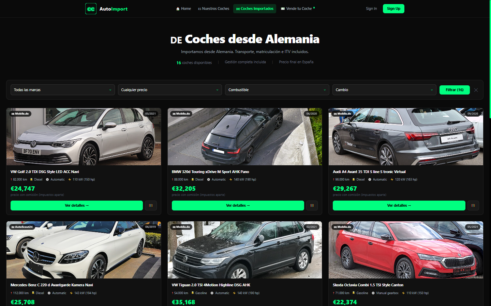
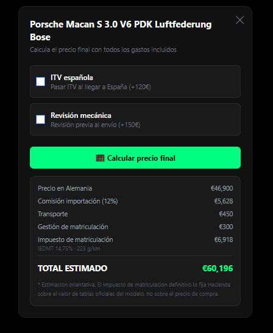

# carsimport

Aplicación full-stack para un negocio de importación de coches de Alemania a
España: un catálogo propio de vehículos ya matriculados aquí, un catálogo de
anuncios alemanes con el precio ya traducido a "lo que te cuesta puesto en
España", y el panel interno para gestionar reservas y ofertas de particulares.

**Angular 19** (standalone components + signals) · **Spring Boot 3.2** ·
**MySQL 8** · **Java 17** · Docker Compose


---

## Qué hace

| Página | Qué resuelve |
|---|---|
| **Inicio** | Carrusel de destacados y últimos anuncios importados |
| **Nuestros coches** | Catálogo nacional con filtros por marca, precio, año, combustible, cambio y estado |
| **Importación** | Anuncios alemanes con el precio final en España ya calculado |
| **Ficha de importado** | Ficha completa + **calculadora de importación** (comisión, transporte, matriculación, IEDMT por tramo de CO₂, ITV, revisión) |
| **Reservar** | Formulario de reserva sobre un coche concreto |
| **Vende tu coche** | Captación: un particular ofrece su coche |
| **Panel admin** | Publicar y editar coches, y gestionar las ofertas recibidas |

La pieza con más lógica de negocio es la **calculadora de importación**: sobre el
precio alemán aplica una comisión escalonada (18 % por debajo de 5.000 €, 15 %
hasta 15.000, 13 % hasta 30.000 y 12 % a partir de ahí) y le suma transporte,
gestión de matriculación y los extras que marque el usuario.

Aparte va el **IEDMT**, el impuesto de matriculación, que es el gasto más grande
después del coche y va por tramos de CO₂ (0 % por debajo de 120 g/km, 4,75 %
hasta 159, 9,75 % hasta 199 y 14,75 % a partir de 200). En un SUV de gasolina
son varios miles de euros, así que la calculadora lo desglosa aparte. Cuando el
anuncio no trae las emisiones **no cobra un 0 %**: avisa de que el impuesto no
está incluido, porque un cero el cliente lo lee como "este coche no paga".

El total es una estimación orientativa: Hacienda liquida el IEDMT sobre el valor
de tablas oficiales del modelo, no sobre el precio de compra, y la app lo dice.



<p align="center">
  
</p>

El desglose de arriba es el del Porsche Macan del catálogo de demostración:
**6.918 € de IEDMT** sobre 46.900 €, porque emite 223 g/km y cae en el tramo
alto. Sin ese impuesto el total daría 53.278 €, un 12 % por debajo de lo que
cuesta de verdad ponerlo en la calle.

---

## Cómo levantarlo

Con Docker es un solo comando. Necesitas Docker y Docker Compose.

```bash
cp .env.example .env
```

Rellena en `.env` las contraseñas y el secreto JWT (mínimo 32 caracteres):

```bash
openssl rand -base64 48
```

Y arranca:

```bash
docker compose up -d --build
```

- Front: <http://localhost:8080>
- API: <http://localhost:8080/api>
- Swagger: la API expone la documentación en `/swagger-ui.html`

La base de datos **no publica ningún puerto**: solo la ven los contenedores de
la red interna.

### Cuentas de la demo

| Usuario | Contraseña | Rol |
|---|---|---|
| `admin` | `password` | ADMIN |
| `cliente` | `password` | USER |

### Sin Docker

```bash
# backend (necesita un MySQL escuchando y las variables de .env exportadas)
cd backend && mvn spring-boot:run

# front
cd CochesFront && npm install && npm start
```

---

## Arquitectura

```
CochesFront/          Angular 19, standalone components, signals, Tailwind 4
  app/pages/          una carpeta por pantalla
  app/components/     fichas de detalle y tarjetas reutilizables
  app/services/       clientes HTTP (un servicio por agregado)
  core/               interceptor de JWT y guards de ruta

backend/              Spring Boot 3.2, Java 17
  controller/         REST, sin lógica
  service/            cálculo de presupuestos, ingesta, traducción
  specification/      filtros dinámicos con JPA Specifications
  security/           SecurityConfig + filtro JWT
  model/ repository/  entidades JPA y repositorios

deploy/               compose de producción con etiquetas de Traefik
```

El front se sirve en producción como estático detrás de Nginx, bajo el mismo
dominio que la API, así que no hay CORS que gestionar fuera de desarrollo.

---

## Decisiones técnicas

**JPA Specifications para los filtros.** El catálogo tiene diez criterios
opcionales. Con métodos derivados de Spring Data harían falta decenas de firmas
o un `@Query` con una ristra de `(:param IS NULL OR campo = :param)`. Cada
`Specification` devuelve `null` cuando su parámetro no viene, y Spring la
ignora: solo se traduce a SQL lo que el usuario ha rellenado de verdad.

**Signals en lugar de un store.** La aplicación no comparte apenas estado entre
pantallas. Las signals de Angular 19 cubren el caso sin añadir NgRx, y la sesión
vive en una única signal derivada de una sola clave de `localStorage`.

**DTO de entrada en el registro, no la entidad.** `/api/auth/register` recibe un
DTO sin `id` ni `role`. Aceptar la entidad `Usuario` entera permitía enviar el
`id` de otra cuenta y que `save()` de JPA hiciera un UPDATE en vez de un INSERT,
apropiándose de ella. Hay test de regresión.

**401 y 403 diferenciados.** Por defecto Spring Security responde 403 tanto al
anónimo como al autenticado sin permisos. Un cliente con token necesita
distinguirlos para saber si tiene que mandar al usuario al login.

**Ningún secreto con valor por defecto.** Ni la contraseña de base de datos ni
el secreto JWT tienen fallback en `application.properties`: si faltan, la
aplicación no arranca. Es preferible a arrancar con una credencial conocida.

---

## Seguridad

Este repositorio es la versión endurecida. Lo que se corrigió, por si sirve de
referencia:

| Problema | Estado |
|---|---|
| API entera abierta (`.anyRequest().permitAll()` con el filtro JWT comentado): cualquiera podía listar reservas con datos de clientes o borrar coches | Corregido |
| Escalada de privilegios en el registro vía `id` en el cuerpo de la petición | Corregido, con test |
| Secreto JWT y contraseña de MySQL escritos en el repositorio | Fuera, a variables de entorno |
| Guards de Angular leyendo el rol de `localStorage` como si eso protegiera algo | Los guards son solo de navegación; quien autoriza es la API |
| 403 en vez de 401 sin autenticar | Corregido |

Los guards del front no son un control de acceso: evitan que se pinte una
pantalla que no toca. La autorización real está en `SecurityConfig`, y es la que
cubren los tests de `ReglasDeAccesoTest`.

---

## Tests

```bash
cd backend && mvn test
```

30 tests sobre H2: reglas de acceso por rol y método, autenticación, la
regresión del registro, los filtros de búsqueda, el endpoint de marcas y los
tramos del IEDMT (fronteras exactas incluidas, y que sin CO₂ no se cobre).

---

## Datos de demostración

**Todo el catálogo de este repositorio es inventado.** Los anuncios reales que
alimentaban la aplicación venían de mobile.de e incluían nombre, teléfono y
WhatsApp de concesionarios alemanes reales: son datos personales de terceros y
su uso incumplía las condiciones de la fuente, así que se eliminaron.

El seed (`backend/src/main/resources/data.sql`) siembra 8 coches nacionales, 16
anuncios importados, y unas cuantas reservas y ofertas para que el panel de
administración no salga vacío. Está construido para que nada pueda confundirse
con un dato real:

- Los concesionarios se llaman "Demo" o "Muster" y su teléfono es
  `+49 000 0000000`, que no existe.
- Las matrículas españolas llevan vocales (`1234 DEM`). La DGT no emite vocales
  en las tres letras, así que ninguna puede corresponder a un coche real.
- Los contactos usan el dominio `example.com`, reservado por el RFC 2606
  precisamente para ejemplos.

El seed se ejecuta en cada arranque, pero cada inserción lleva su guarda
`WHERE NOT EXISTS`: levantar el proyecto dos veces no duplica el catálogo.

### Fotografías

Las imágenes son de **Wikimedia Commons**, con licencias CC BY-SA, CC BY y CC0
según el archivo. Se enlazan a `upload.wikimedia.org`, no se copian a este
repositorio; la ficha de cada foto, con su autor y su licencia, está en Commons
buscando el nombre del archivo que aparece en la URL.

---

## Estado del proyecto

El negocio de importación no está activo. El repositorio se mantiene como
proyecto de muestra: la aplicación funciona de principio a fin con el seed de
demostración.
